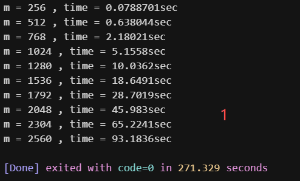
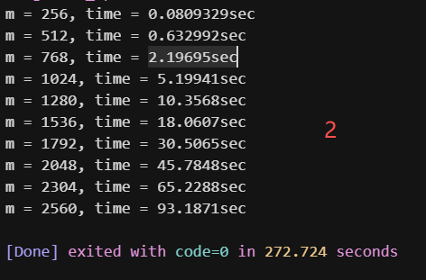
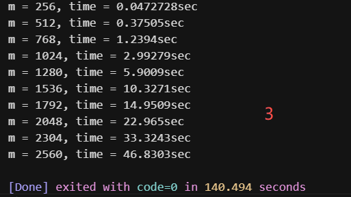
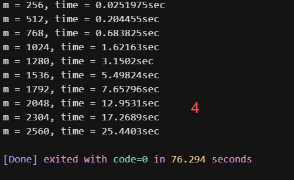
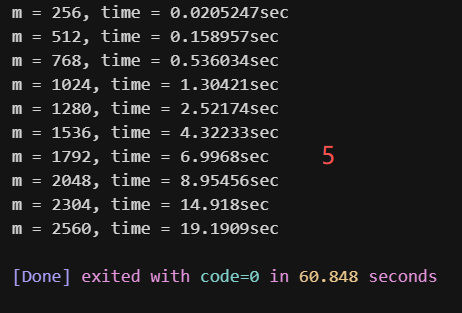

## Task:

(said by Chris)

What we want to do is to implement “matrix multiply followed by subtract max” over two square matrices. You know matrix multiply; what we want is a code that also finds the max value in each row, and subtracts it from each entry in that row.

Here's exactly what I'd like you to do. Start with the "stupid" implementation, where you just do a nested loops matrix multiply, you write out the result, and then you do a row-by-row subtract-max. See how fast it is on a matrix multiply of two matrices both of size M by M, for M in {256 \* x for x in 1, 2, 3, ..., 10}. Then try to make it faster. Write a little report. Each time you try something, describe what you did, and if it helped!

## Env setup

WSL, Git, CPU flag ensure, Makefile, try to run dgemm_x86[0 - 19]

## Review

[Github repo reference](https://github.com/yzhaiustc/Optimizing-DGEMM-on-Intel-CPUs-with-AVX512F#how-to-optimize-dgemm-on-x86-cpu-platforms)

## Play around for opt (C++)

### 1. naive

comments: quite slow

### 2. use register

C(i,j) is irrelevant to the innermost loop index k, therefore, one can load it into the register before entering the k-loop to avoid unnecessary memory access.

An array element, it must reside in memory. cij is a local scalar variable, it can be placed in a register.

use pointer

comments: theoretically it should be improved. But it seems no use in practice.

### 3. register blocking

update the whole 2x2 block of C matrix by loading a 2x1 slice of A and an 1x2 slice of B. Then we conduct an outer-product rank-1 update on the 2x2 C block.

comments: great improvement !

### 4. register blocking plus

just as same as 3., add more register blocking. (4 \* 4)

comments: Obviously, it should be improved, because there are more register blockings.

### 5. SIMD

process data using Single Instruction Multiple Data (SIMD) instructions. SIMD can process 4 float elements at a lane, and improve cache utilization.

comments: because we use the SIMD instructions instead of scalar instructions, we get great great improvement.
